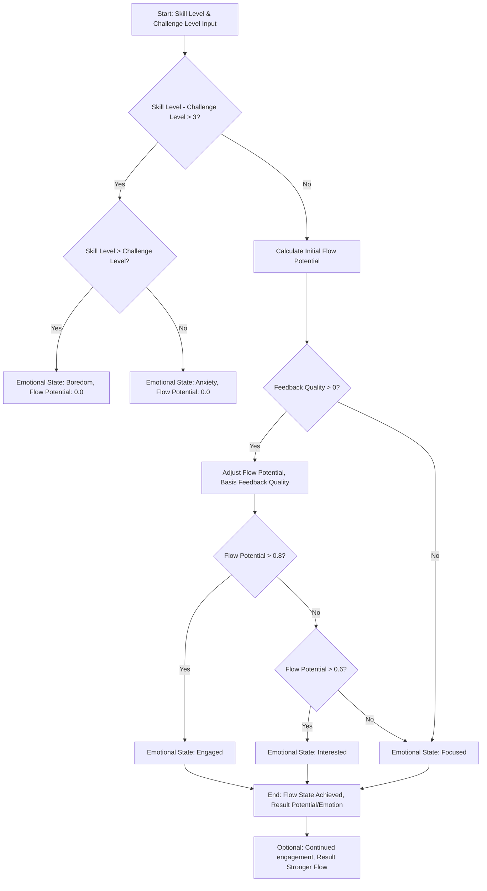
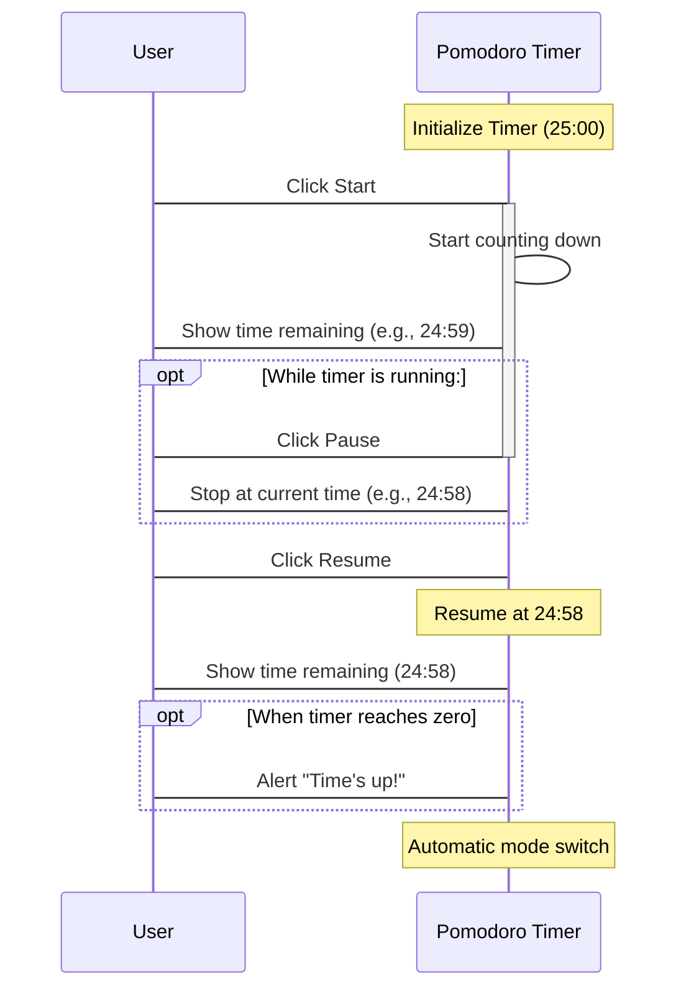

# Project Diagrams

## Flow Process Chart 

```mermaid
graph TD
    A[Start: Skill Level & Challenge Level Input] --> B
    B{ Skill Level - Challenge Level > 3?};
    B -- Yes --> C{ Skill Level > Challenge Level? };
    C -- Yes --> D[Emotional State: Boredom, Flow Potential: 0.0];
    C -- No --> E[Emotional State: Anxiety, Flow Potential: 0.0];
    B -- No --> F[Calculate Initial Flow Potential];
    F --> G{ Feedback Quality > 0?};
    G -- Yes --> H[Adjust Flow Potential, Basis Feedback Quality];
    H --> I{Flow Potential > 0.8?};
    I -- Yes --> J[Emotional State: Engaged];
    I -- No --> K{Flow Potential > 0.6?};
    K -- Yes --> L[Emotional State: Interested];
    K -- No --> M[Emotional State: Focused];
    G -- No --> M;
    M --> N[End: Flow State Achieved, Result Potential/Emotion];
    N --> O[Optional: Continued engagement, Result Stronger Flow];
    J --> N;
    L --> N;
```
## Task Timer Sequence Diagram

```mermaid
sequenceDiagram
    participant User as User
    participant Timer as Pomodoro Timer

    Note over Timer: Initialize Timer (25:00)
    User->Timer: Click Start
    activate Timer
    Timer->Timer: Start counting down
    Timer->User: Show time remaining (e.g., 24:59)

    opt While timer is running:
        User->Timer: Click Pause
        deactivate Timer
        Timer->User: Stop at current time (e.g., 24:58)
    end

    User->Timer: Click Resume
    Note over Timer: Resume at 24:58
    Timer->User: Show time remaining (24:58)

    opt When timer reaches zero
        Timer->User: Alert "Time's up!"
    end

    Note over Timer: Automatic mode switch
```